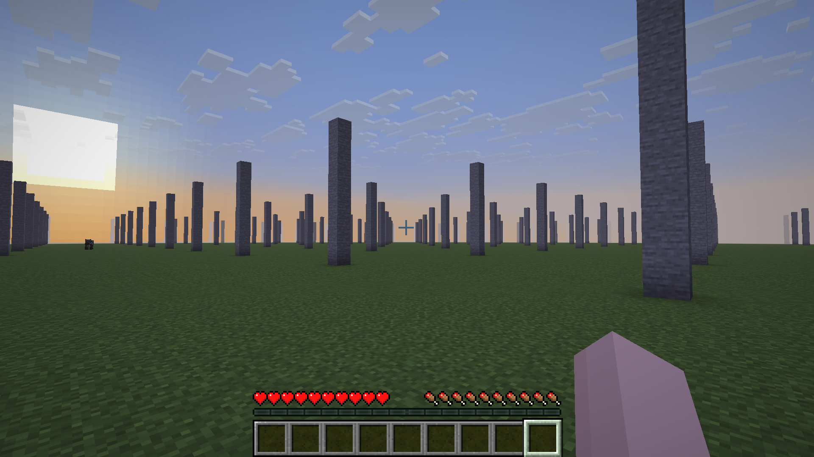

# mc-anvil-db

A FUSE-based virtual filesystem for Minecraft that intercepts and simulates `.mca` region files. It provides a programmable storage layer for the Anvil format, enabling on-the-fly chunk generation and virtualized world management with zero local disk footprint.



## Overview

Currently, this project acts as a **Stateless Infinite Flat World Generator**.

**Key Features:**
- [x] 🚀 **Infinite World**: Generates chunks procedurally as Minecraft requests them (Stateless).
- [x] 🔄 **Negative Coordinates**: Fully supports infinite exploration in all directions (negative X/Z).
- [x] 📁 **Anvil Format**: Emulates standard Minecraft region headers and chunk data (Works with Paper 1.21+).
- [x] 🐳 **Docker-first**: Runs in a container with FUSE permissions (`/dev/fuse`).
- [x] 🛠 **Generic File Support**: Handles auxiliary files (like backups) gracefully to prevent server crashes.

## Architecture

```
┌─────────────────────────────────────────────────────┐
│                  Minecraft Server                   │
│                    (Paper 1.21+)                    │
└─────────────────────┬───────────────────────────────┘
                      │ reads "r.x.z.mca"
                      ▼
┌─────────────────────────────────────────────────────┐
│                    FUSE Layer                       │
│              (src/fuse/mod.rs)                      │
│            Intercepts File I/O                      │
├─────────────────────────────────────────────────────┤
│                 World Generator                     │
│            (src/generator/flat.rs)                  │
│          Generates chunks on-the-fly                │
└─────────────────────────────────────────────────────┘
```

## Project Structure

```
src/
├── main.rs           # Entry point & FUSE Mount
├── fuse/
│   ├── mod.rs        # FUSE Filesystem Logic (Read/Write interception)
│   ├── inode.rs      # Inode packing logic (handling < 0 coordinates)
│   └── virtual_file.rs # Virtual MCA file logic (Header + Chunk generation)
├── generator/
│   ├── mod.rs        # WorldGenerator Trait
│   ├── flat.rs       # Flat World Implementation
│   └── builder.rs    # Helper to build NBT chunks
├── chunk.rs          # NBT Data Structures (Chunk, Section, BlockStates)
└── region/           # MCA header/offset calculations
```

## Storage Backends

| Backend | Status | Use Case |
|---------|--------|----------|
| **Stateless Generator** | ✅ **Active** | Infinite flat world, testing |
| `PostgresStorage` | 🛠 **Ready for Dev** | Environment included, code structures present |
| `MemoryStorage` | 🚧 Planned | Fast temporary storage |

## Quick Start

### With Docker (Recommended)

```bash
# 1. Start the FUSE filesystem and Minecraft server
docker compose up --build

# 2. Connect to localhost:25565
```

This starts:
- `mc-anvil-db`: The FUSE filesystem mounting to `/mnt/region`.
- `minecraft`: A Paper server configured to use the FUSE mount.

**Note:** Any blocks you place or destroy **will NOT be saved** in the current "Stateless" mode. The server "writes" the data, but the FUSE layer simply acknowledges the write without persisting it.

## How It Works

1. **Minecraft requests `r.0.0.mca`**: FUSE intercepts the `open` and `read` calls.
2. **Header Generation**: FUSE calculates where chunks *would* be in a real file.
3. **Chunk Generation**: When Minecraft reads a specific sector, `FlatGenerator` builds the NBT data (Bedrock, Dirt, Grass) in RAM.
4. **Compression**: The chunk is Zlib-compressed and sent to Minecraft.
5. **Writes**: If Minecraft saves the world, FUSE accepts the bytes (to prevent errors) but generally discards them in stateless mode.

## Troubleshooting

- **"Transparent Chunks"**: If you see transparent chunks that you can walk on, it usually means the server read "0 bytes" (EOF) unexpectedly. This has been fixed in v0.0.3 by correcting inode packing logic.
- **Slow Loading**: Ensure debug logging is disabled in production.

## License

MIT
