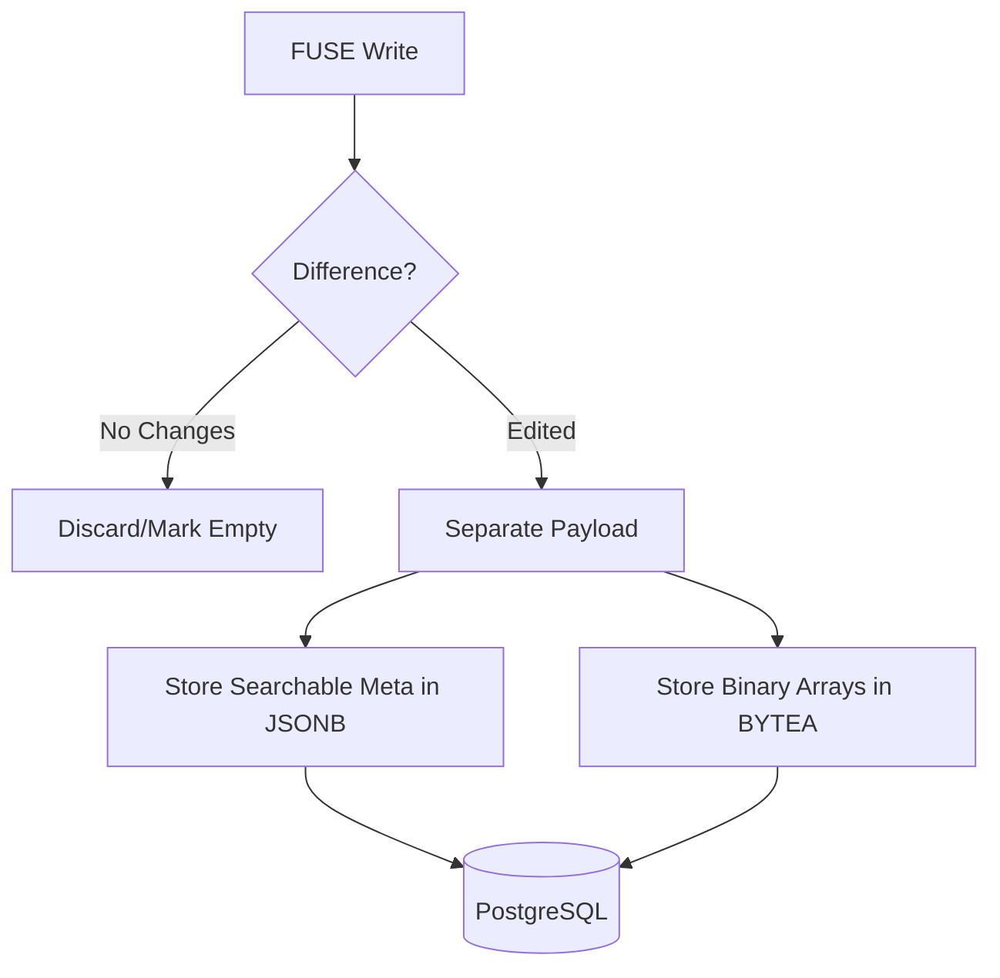

# Brainstorm: pg_jsonb_opt

The current `pg_jsonb` mode is great for readability but inefficient (50MB DB vs 8MB MCA). To reach `opt` status, we need to eliminate redundancy and reduce the storage footprint while keeping it queryable.

## Hypothesis 1: Section Deduplication (Hash-based)
Minecraft worlds consist of many identical 16x16x16 sections (Empty Air, Solid Stone, Deepslate Layers).
- **Idea**: Store `sections` in a separate table `chunk_sections` keyed by a SHA-256 hash of their content.
- **Table `chunk_sections`**: `hash (BYTEA PK), data (JSONB)`
- **Table `chunks_jsonb_opt`**: `x, z, section_hashes (TEXT[])`
- **Result**: Drastic reduction for worlds with large monotonous areas.

## Hypothesis 2: Generator-Relative Storage (Weightless)
Since we have a deterministic world generator (`Flat` or `Vanilla`), we shouldn't store what we can regenerate.
- **Idea**: Store ONLY the difference from the generated state.
- **Implementation**: 
    1. Load chunk.
    2. Generate "base" chunk via `hoppermc-gen`.
    3. JSONB contains only: 
        - Modified block coordinates + new state.
        - Inventories (Chests, Furnaces).
        - Entities that moved or were spawned.
- **Result**: Exploration costs almost 0 disk space. Only "civilized" areas take space.

## Hypothesis 3: Hybrid JSONB + Binary Blobs
JSONB is inefficient for large uniform arrays (Light arrays, high-entropy BlockState arrays).
- **Idea**: Separate the "Searchable" from the "Payload".
- **Structure**:
    - `column JSONB`: Contains palettes, biome information, entities, and "summary" (e.g., `has_diamonds: true`).
    - `column BYTEA`: Contains the raw bit-packed `BlockStates` and `Light` arrays, compressed with Zstd/LZ4.
- **Result**: Query capabilities for important metadata remains, but total size drops back to MCA levels.

## Hypothesis 4: Palette Normalization
Instead of repeating strings like `"minecraft:deepslate_diamond_ore"` thousands of times in JSONB:
- **Idea**: A global `block_registry` table.
- **Structure**: JSONB uses integer IDs from the registry.
- **Result**: Significant shrinkage of the JSON document size. Meta-queries can be done via `JOIN`.

## Proposed Architecture for `pg_jsonb_opt`

### Challenges to Consider:
1. **CPU Overhead**: Calculating diffs or re-generating base chunks on every read.
2. **Complexity**: Handling Minecraft version updates (if the generator changes, the diffs might break).
3. **Joins**: Querying the world via SQL becomes harder if data is split across tables.
